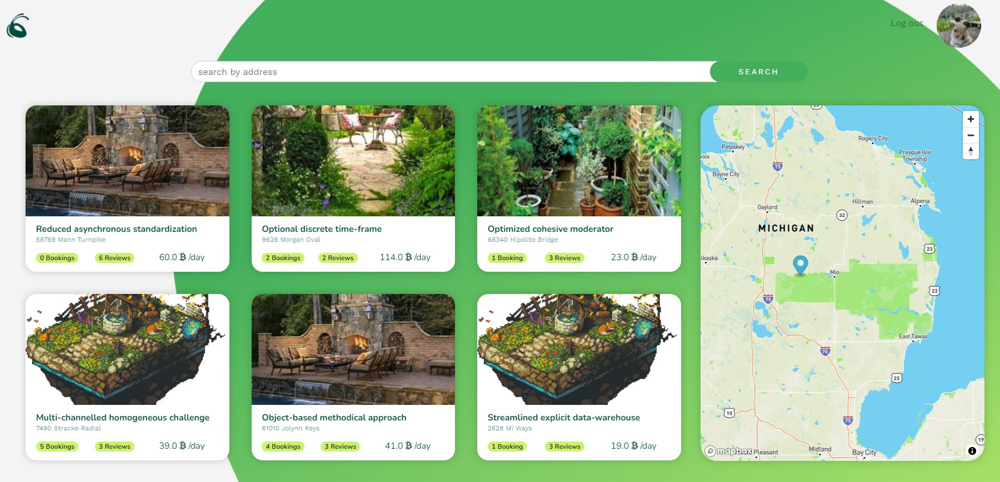

# GARDNR
## A marketplace app allowing to rent your garden or book a garden for any occasion.

This project is my solo version of project done during Le Wagon coding bootcamp - Ants in Your Pants.
Originally, we build the app under the supervision of teachers in the team of three during two weeks period.

The idea behind the project was to write a first production-ready Rails project.
The application was supposed to be an Airbnb clone in spirit, but with something more enjoyable than rent than flats. 😉

We quickly came to an idea that during lockdown we'll be renting gardens to have a safe, distanced contact with our friends.
And that's how **[ANTS IN YOUR PANTS](https://github.com/anadamastor/rails-ants-in-your-pants)** was born.

This repo is my attempt to recreate the whole app by myself as a good excersise in preparation for interview and to avoid questions like "Which part of that application was done by you?" 🤨

The application is deployed to heroku and available here:
## [GARDNR](https://gardnr.herokuapp.com/)


<table>
  <tr>
    <td></td>
    <td></td>
    <td></td>
  </tr>
</table>

## Getting Started
### Setup

Install gems
```
bundle install
```
Install JS packages
```
yarn install
```

### ENV Variables
Create `.env` file
```
touch .env
```
Inside `.env`, set these variables.
```
CLOUDINARY_URL=your_own_cloudinary_url_key
MAPBOX_API_KEY=your_own_mapbox_url_key
```

### DB Setup
```
rails db:create
rails db:migrate
rails db:seed
```

### Run a server
```
rails s
```

### Log in as testing@testing.com
### Password: testing

## Enjoy!!

---


## Dev log

### Built With
- [Rails 6](https://guides.rubyonrails.org/) - Backend / Front-end
- [Stimulus JS](https://stimulus.hotwired.dev/) - Front-end JS
- [Heroku](https://heroku.com/) - Deployment
- [PostgreSQL](https://www.postgresql.org/) - Database
- [Bootstrap](https://getbootstrap.com/) — Styling
- [Figma](https://www.figma.com) — Prototyping


<h3 align="center">Languages and Tools:</h3>
<p align="center">
<a href="https://www.ruby-lang.org/en/" target="_blank" rel="noreferrer">  </a>
<a href="https://rubyonrails.org" target="_blank" rel="noreferrer">  </a>
<a href="https://www.postgresql.org" target="_blank" rel="noreferrer">  </a>
<a href="https://developer.mozilla.org/en-US/docs/Web/JavaScript" target="_blank" rel="noreferrer">  </a>
<a href="https://www.w3.org/html/" target="_blank" rel="noreferrer">  </a>
<a href="https://www.w3schools.com/css/" target="_blank" rel="noreferrer">  </a>
<a href="https://getbootstrap.com" target="_blank" rel="noreferrer">  </a>
<a href="https://git-scm.com/" target="_blank" rel="noreferrer">  </a> <a href="https://heroku.com" target="_blank" rel="noreferrer">  </a>
<a href="https://www.figma.com/" target="_blank" rel="noreferrer">  </a>
<a href="https://www.linux.org/" target="_blank" rel="noreferrer">  </a> <a href="https://www.photoshop.com/en" target="_blank" rel="noreferrer">  </a>
</p>

## The final schema of the application


## Back End
Application consist of four models:
- User
  - Entire User logic was created using [DEVISE](https://github.com/heartcombo/devise)
  - Authentication logic
  - One to many reference with Gardens, Booking and Reviews
  - Photo attachment using [Cloudinary](https://cloudinary.com/) as active_storage
- Garden
  - Backbone of the aplication
  - All CRUD actions
  - One to many with booking and Reviews, many to many with Users through Bookings.
  - Photo attachment using [Cloudinary](https://cloudinary.com/) as active_storage
  - Geocoded using [Mapbox](https://www.mapbox.com/)
  - Search using [pg_search](https://github.com/Casecommons/pg_search)
- Booking
  - Many to many between User and Garden.
  - Date selection done using [Flatpickr](https://github.com/zokioki/flatpickr-rails)
- Review
  - Reference to User and Garden, nested in Gardens routes.


## Front End

### There are two aspects of front end I'd like to mention

#### Animated Background
Animated background of the application is pure CSS and something I'm most proud of.
It consists of a svg shape filled with linear gradient...
```
<div class="blob">
  <svg xmlns:xlink="http://www.w3.org/1999/xlink" version="1.1" xmlns="http://www.w3.org/2000/svg" viewBox="0 0 310 350">
  <path d="M156.4,339.5c31.8-2.5,59.4-26.8,80.2-48.5c28.3-29.5,40.5-47,56.1-85.1c14-34.3,20.7-75.6,2.3-111  c-18.1-34.8-55.7-58-90.4-72.3c-11.7-4.8-24.1-8.8-36.8-11.5l-0.9-0.9l-0.6,0.6c-27.7-5.8-56.6-6-82.4,3c-38.8,13.6-64,48.8-66.8,90.3c-3,43.9,17.8,88.3,33.7,128.8c5.3,13.5,10.4,27.1,14.9,40.9C77.5,309.9,111,343,156.4,339.5z"/>
    <linearGradient id="header-shape-gradient" x2="0.35" y2="1">
        <stop offset="0%" stop-color="var(--color-stop)" />
        <stop offset="30%" stop-color="var(--color-stop)" />
        <stop offset="100%" stop-color="var(--color-bot)" />
    </linearGradient>
  </svg>
```
...and simple css transformation where using key frames I'm rotating and rescaling object creating illusion of this fluid-like pulsation.
```
.blob {
  position: absolute;
  top: 0;
  right: 20vw;
  fill: url(#header-shape-gradient) #fff;
  width: 50vmax;
  z-index: -1;
  animation: move 20s ease-in-out infinite;
  transform-origin: 50% 50%;
}

#header-shape-gradient {
  --color-stop: #43af5c;
  --color-bot: #ccf26b;
}


@keyframes move {
  0%   { transform: scale(1.8)   translate(10px, -30px); }
  38%  { transform: scale(1.3, 1) translate(40vw, -40vh) rotate(160deg); }
  40%  { transform: scale(1.3, 1) translate(40vw, -40vh) rotate(160deg); }
  78%  { transform: scale(2) translate(0vw, 20vh) rotate(-20deg); }
  80%  { transform: scale(2) translate(0vw, 20vh) rotate(-20deg); }
  100% { transform: scale(1.8)   translate(10px, -30px); }
}
```

#### Main Page buttons
Another feature I take pride in are buttons on the main site.
```
<div class="main_buttons">
  <%= link_to "Rent a Garden", gardens_path, class: "main_rent" %>
  <%= link_to "List a Garden", new_garden_path, class: "main_list" %>
</div>
```
Once again, they were done with pure CSS with simple animation to simulate bouncing effect.
```
.main_rent {
  color: white;
  font-size: 2rem;
  background: #43af5c ;
  border: none ;
  padding: 2vmin 3rem;
  border-radius: 30px;
  transition: opacity 0.3s ease;
  margin: 20px;
}

.main_rent:hover {
  opacity: 1;
  text-decoration: none;
  color: white;
  animation: spring 3s;
  animation-timing-function: ease;
  animation-iteration-count: infinite;
}

@keyframes spring {
  0% { transform: scale(1) translateY(0); }
  10% { transform: scale(1.2, 0.6); }
  30% { transform: scale(0.8, 1.1) translateY(-50px); }
  50% { transform: scale(1) translateY(0); }
  100% { transform: translateY(0); }
}
```

## Conclusion

I've rebuilt the entire back-end with all features described here by myself.
The front end was already of my authorship as well as UX/UE of the application, so that part was just copied.
Everything above took me three evenings in total until now.
The application is partially tested with CI/CD integration using Github Actions, but there is still a lot of stuff to do and add, for example:
- Incorporate AJAX to Reviews display.
- Add Pundit for Authorization
- Proper User/Profile dashboard
- User WebSocket & ActionCable to build some simple chat or message system and incorporate this in bookings.


## Acknowledgements

Big thumbs up for [Mike](https://github.com/michaelbarrett343) for original name idea. Works great during interviews. Not problematic at all mate. 👍

Sorry [Ervis](https://github.com/anadamastor) but I've left out some of your secret features from the original app. You know which ones. Those are yours and yours only! 🤣

## Contributing
Any pull requests are welcome. For major changes, please open an issue first to discuss what you would like to change.

## License
This project is licensed under the MIT License.
